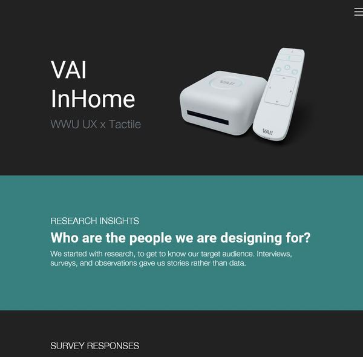

# VAI InHome LongScroll

> UX/UI collaboration to develop a concept in a team of three based on the prompt, “How can we help aging adults age in place?” 

The VAI InHome Long Scroll website is meant to be a record of what our team accomplished in the 10 weeks of developing our solution to the prompt, “How can we help aging adults age in place?” For more info on the project, visit the site!

https://vai.colbehr.com/

https://www.colbehr.com/projects/vaiinhome/

## Development setup

This project is simply built with Bootstrap 5 and some vanilla javascript, along with some small libraries for various tasks.

- `git clone https://github.com/colbehr/VAILongScroll`

